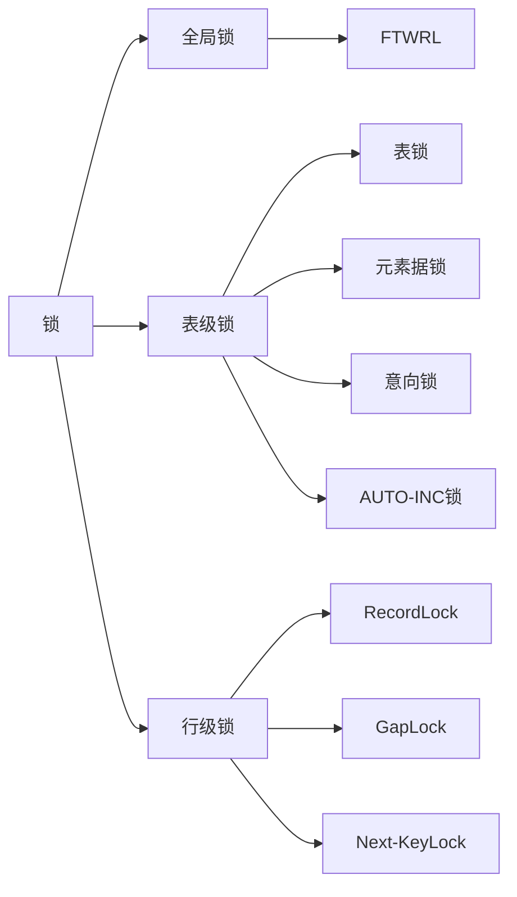

### MySQL锁

#### MySQL有哪些锁？



#### 全局锁

##### 全局锁如何上锁与释放锁？

- 上锁`flush tables with read lock`
- 释放锁`unlock tables`,断开会话，全局锁也会自动释放。

##### 全局锁一般应用到什么场景中？

- 系统全库逻辑备份
- 系统数据迁移与维护

可以使用InnoDB的隔离特性，在备份数据库前开启事务，这样就不会影响业务了。

#### 表锁

- 加表锁
  ```sql
  #表级别的共享锁，也就是读锁；
  lock tables t_student read;
  
  #表级别的独占锁，也就是写锁；
  lock tables t_stuent write;
  ```

- 释放表锁
  ```mysql
  unlock tables
  ```

#### 元数据锁（MDL）

- 对一张表进行 CRUD 操作时，加的是 **MDL 读锁**；
- 对一张表做结构变更操作的时候，加的是 **MDL 写锁**；
- 事务提交后才会释放锁。

#### 意向锁

- 在使用 InnoDB 引擎的表里对某些记录加上「共享锁」之前，需要先在表级别加上一个「意向共享锁」；
- 在使用 InnoDB 引擎的表里对某些纪录加上「独占锁」之前，需要先在表级别加上一个「意向独占锁」；

- select加共享锁与独占锁的方式
  ```mysql
  #先在表上加上意向共享锁，然后对读取的记录加共享锁
  select ... lock in share mode;
  
  #先表上加上意向独占锁，然后对读取的记录加独占锁
  select ... for update;
  ```

- 意向共享锁和意向独占锁是表级锁，不会和行级的共享锁和独占锁发生冲突，而且意向锁之间也不会发生冲突，只会和共享表锁（`lock tables ... read`）和独占表锁（`lock tables ... write`）发生冲突。

- 意向锁的目的是为了快速判断表里是否有记录被加锁。

#### AUTO-INC 锁

AUTO-INC 锁是特殊的表锁机制.在MySQL5.1.22版本后有别的轻量锁。

InnoDB 存储引擎提供了个 innodb_autoinc_lock_mode 的系统变量，是用来控制选择用 AUTO-INC 锁，还是轻量级的锁。

- 当 innodb_autoinc_lock_mode = 0，就采用 AUTO-INC 锁，语句执行结束后才释放锁；
- 当 innodb_autoinc_lock_mode = 2，就采用轻量级锁，申请自增主键后就释放锁，并不需要等语句执行后才释放。
- 当 innodb_autoinc_lock_mode = 1：
  - 普通 insert 语句，自增锁在申请之后就马上释放；
  - 类似 insert … select 这样的批量插入数据的语句，自增锁还是要等语句结束后才被释放；

当设置的 innodb_autoinc_lock_mode = 2，并且搭配的binlog的日志格式为statement时，会发生主从复制不一致的情况。

**当 innodb_autoinc_lock_mode = 2 时，并且 binlog_format = row，既能提升并发性，又不会出现数据一致性问题**。

#### 行级锁

InnoDB 引擎是支持行级锁的，而 MyISAM 引擎并不支持行级锁。

- Record Lock，记录锁，也就是仅仅把一条记录锁上；有独占锁（X锁）与共享锁（S锁）
  ```mysql
  #对读取的记录加共享锁
  select ... lock in share mode;
  
  #对读取的记录加独占锁
  select ... for update;
  ```

  

- Gap Lock，间隙锁，锁定一个范围，但是不包含记录本身；
  

- Next-Key Lock：临键锁，Record Lock + Gap Lock 的组合，锁定一个范围，并且锁定记录本身。
  

#### 插入意向锁

判定插入的位置是否有临键锁或者间隙锁，如果有锁，就会生成一个插入意向锁，并且阻塞。


当有间隙锁时，插入id=4会进入阻塞状态，只有当锁消失时，才能进行插入。

#### MySQL在什么情况下会加行级锁？

普通的select语句在可重复读的隔离级别下是不会对记录加锁的，它属于快照读，是通过MVCC实现的。

但是特定的查询语句会加锁，如：
```mysql
#对读取的记录加共享锁(S型锁)
select ... lock in share mode;

#对读取的记录加独占锁(X型锁)
select ... for update;
```

或者

```mysql
#对操作的记录加独占锁(X型锁)
update table .... where id = 1;

#对操作的记录加独占锁(X型锁)
delete from table where id = 1;
```

#### MySQL是怎么加行级锁的？

加锁的对象是索引，加锁的基本单位是 next-key lock。它是由记录锁和间隙锁组合而成的，**next-key lock 是前开后闭区间，而间隙锁是前开后开区间**。

并且在一定的条件下，**next-key lock会退化成记录锁或间隙锁。**

**在能使用记录锁或者间隙锁就能避免幻读现象的场景下， next-key lock 就会退化成记录锁或间隙锁**。

- 当唯一索引查询存在当条记录时，会退化成记录锁。
- 当查询的记录不存在时，会退化成间隙锁。

使用`select * from performance_schema.data_locks\G;`可以查看事务在执行过程加了什么锁。

- 如果 LOCK_MODE 为 `X`，说明是 next-key 锁；
- 如果 LOCK_MODE 为 `X, REC_NOT_GAP`，说明是记录锁；
- 如果 LOCK_MODE 为 `X, GAP`，说明是间隙锁；

#### 为什么当唯一索引查询==存在==当条记录时，next-key lock会退化成记录锁？

因为单单依靠记录锁便可以避免幻读。

- 由于主键具有唯一性，当出现相同id时，因为主键冲突，使得无法插入多条数据相同的记录。
- 对单条记录加记录锁，使得这条记录没办法被删掉，从而也避免了幻读。

#### 为什么当不存在时，next-key lock会退化成间隙锁？

因为此时间隙锁可以避免幻读发生。

- 当再次查询这个不存在的记录时，因为加了间隙锁，其他事务对这个索引的记录没办法进行添加。
- 而且因为索引不存在，索引加不了记录锁。

#### 唯一索引范围查询

##### 当出现的语句是大于时

如：
```mysql
mysql> begin;
Query OK, 0 rows affected (0.00 sec)

mysql> select * from user where id > 15 for update;
+----+-----------+-----+
| id | name      | age |
+----+-----------+-----+
| 20 | 香克斯    |  39 |
+----+-----------+-----+
1 row in set (0.01 sec)
```

则会加两个间隙锁，锁1为查询指到最后一个值，锁2为最后一个值到正无穷，都是左开右闭区间。

##### 当出现大于等于时会出现三个锁

如：
```mysql
mysql> select * from user where id >= 15 for update;
+----+-----------+-----+
| id | name      | age |
+----+-----------+-----+
| 15 | 乌索普    |  20 |
| 20 | 香克斯    |  39 |
+----+-----------+-----+
2 rows in set (0.00 sec)
```


##### 针对小于范围查询，并且查询条件值不存在时。

```mysql
mysql> begin;
Query OK, 0 rows affected (0.00 sec)

mysql> select * from user where id < 6 for update;
+----+--------+-----+
| id | name   | age |
+----+--------+-----+
|  1 | 路飞   |  19 |
|  5 | 索隆   |  21 |
+----+--------+-----+
3 rows in set (0.00 sec)
```

会有三个锁，范围负无穷到1的临键锁（next-key),1到最后一个存在数值的next-key锁。已经存在数值到下一个超出范围的间隙锁。


##### 针对小于等于，并且查询条件数值存在时。

```mysql
mysql> begin;
Query OK, 0 rows affected (0.00 sec)

mysql> select * from user where id <= 5 for update;
+----+--------+-----+
| id | name   | age |
+----+--------+-----+
|  1 | 路飞   |  19 |
|  5 | 索隆   |  21 |
+----+--------+-----+
2 rows in set (0.00 sec)
```

会存在两个锁，一个是负无穷到1的临键锁，一个是1到最后一个元素的临键锁。


##### 针对小于范围查询，并且查询记录存在时

`````mysql
select * from user where id < 5 for update;
`````

会存在两个锁，一个时负无穷到1的next-key锁，另一个时1到存在记录值的间隙锁。


#### 非唯一索引等值查询

##### 当查询的记录不存在时

```mysql
mysql> begin;
Query OK, 0 rows affected (0.00 sec)

mysql> select * from user where age = 25 for update;
Empty set (0.00 sec)
```

临键锁会退化成间隙锁


##### 当查询的记录存在时

```mysql
mysql> begin;
Query OK, 0 rows affected (0.00 sec)

mysql> select * from user where age = 22 for update;
+----+--------+-----+
| id | name   | age |
+----+--------+-----+
| 10 | 山治   |  22 |
+----+--------+-----+
1 row in set (0.00 sec)
```


#### 非唯一索引范围查询

**非唯一索引范围查询，索引的 next-key lock 不会有退化为间隙锁和记录锁的情况**

```mysql
mysql> begin;
Query OK, 0 rows affected (0.00 sec)

mysql> select * from user where age >= 22  for update;
+----+-----------+-----+
| id | name      | age |
+----+-----------+-----+
| 10 | 山治      |  22 |
| 20 | 香克斯    |  39 |
+----+-----------+-----+
2 rows in set (0.01 sec)
```


**主键索引加记录锁，二级索引加next-key锁**

#### 没有加索引的查询

没有加索引进行查询时，查询的时全表扫描。**如果锁定读查询语句，没有使用索引列作为查询条件，或者查询语句没有走索引查询，导致扫描是全表扫描。那么，每一条记录的索引上都会加 next-key 锁，这样就相当于锁住的全表，这时如果其他事务对该表进行增、删、改操作的时候，都会被阻塞**。

因此，**在线上在执行 update、delete、select ... for update 等具有加锁性质的语句，一定要检查语句是否走了索引，如果是全表扫描的话，会对每一个索引加 next-key 锁，相当于把整个表锁住了**。

#### 唯一索引（主键索引）加锁的流程图


#### 非唯一索引加锁的流程图


#### 如何避免update语句在执行时，不会把全表上锁？

MySQL 里的 `sql_safe_updates` 参数设置为 1，开启安全更新模式。

此时：

update 语句必须满足如下条件之一才能执行成功：

- 使用 where，并且 where 条件中必须有索引列；
- 使用 limit；
- 同时使用 where 和 limit，此时 where 条件中可以没有索引列；

delete 语句必须满足以下条件能执行成功：

- 同时使用 where 和 limit，此时 where 条件中可以没有索引列；

如果 where 条件带上了索引列，但是优化器最终扫描选择的是全表，而不是索引的话，我们可以使用 `force index([index_name])` 可以告诉优化器使用哪个索引，以此避免有几率锁全表带来的隐患。

#### MySQL死锁发生的条件是什么？

因为间隙锁与间隙锁是兼容的，所以当多个事务同时插入时，需要获取插入意向锁，但是插入意向锁与间隙锁是冲突的，所以会造成死锁等待。


##### 为什么间隙锁与间隙锁之间是兼容的？

**间隙锁的意义只在于阻止区间被插入**，因此是可以共存的。**一个事务获取的间隙锁不会阻止另一个事务获取同一个间隙范围的间隙锁**。

两个next-key lock是不兼容的，因为next-key lock 是由间隙锁与记录锁共同组成的。

##### 插入意向锁是什么？

插入意向锁是一种特殊的间隙锁，但不同于间隙锁的是，该锁只用于并发插入操作。它是一个点，用于判断是否有有锁结构。因为MySQL 加锁时，是先生成锁结构，然后设置锁的状态，如果锁状态是等待状态，并不是意味着事务成功获取到了锁，只有当锁状态为正常状态时，才代表事务成功获取到了锁。

##### insert语句中隐式锁怎么转化为显示锁？

当事务A插入一条语句是，并不会马上生成实际的锁结构，当事务B再次插入相同的记录时,隐式锁将转化成显示锁，并变成记录锁，从而使得事务B陷入阻塞。如同：


当事务A插入记录成功后，记录被隐式锁保护。接着，事务 B 也插入 order_no 为 1006 的记录，由于事务 A 已经插入 order_no 值为 1006 的记录，所以事务 B 在插入二级索引记录时会遇到重复的唯一二级索引列值，此时事务 B 想获取一个 S 型 next-key 锁，但是事务 A 并未提交，**事务 A 插入的 order_no 值为 1006 的记录上的「隐式锁」会变「显示锁」且锁类型为 X 型的记录锁，所以事务 B 向获取 S 型 next-key 锁时会遇到锁冲突，事务 B 进入阻塞状态**。

##### 如果插入了不是唯一二级索引，那么将发生幻读


#### 如何避免MySQL死锁？

- 设置事务等待锁的超时时间。在 InnoDB 中，参数 `innodb_lock_wait_timeout` 是用来设置超时时间的，默认值时 50 秒。
- 开启主动死锁检测。将参数 `innodb_deadlock_detect` 设置为 on，表示开启这个逻辑，默认就开启。

