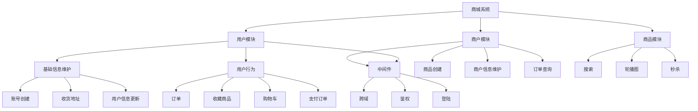

### 商城系统划分

[toc]

#### 1.全局划分

```mermaid
graph TD;
	商城系统 -->用户模块;
	商城系统 -->商户模块;
	商城系统 -->商品模块;
	用户模块 -->中间件;
	用户模块 -->基础信息维护;
	用户模块 -->用户行为;
	用户行为 -->订单;
	用户行为 -->收藏商品;
	用户行为 -->购物车;
	用户行为 -->支付订单;
	基础信息维护 -->账号创建;
	基础信息维护 -->收货地址;
	基础信息维护 -->用户信息更新
	商户模块 -->商品创建;
	商户模块 -->商户信息维护;
	商户模块 -->订单查询;
	商户模块 -->中间件;
	商品模块 -->搜索;
	商品模块 -->轮播图;
	商品模块 -->秒杀;
	中间件 -->跨域;
	中间件 -->鉴权;
	中间件 -->登陆;
```

#### 2. 关于数据库

- 是否要共享数据库？

  共享同一数据库

- 要开几个数据库？数据库里面存的内容分别是什么？

  - 开一个数据库，然后多个表
  - 用户信息模块数据库
  - 商户模块
  - 商品模块
  

#### 3.分离项目经验

- 先把全体挪过来，再进行删除
- 
